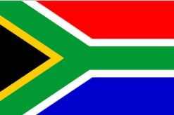
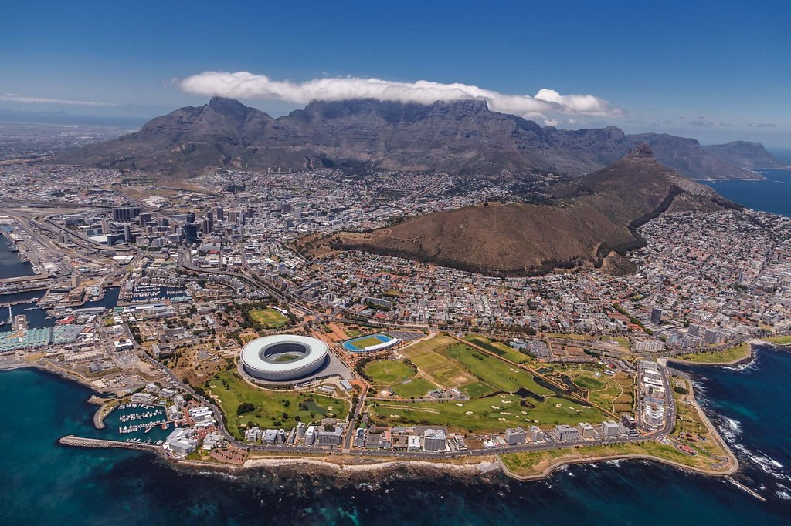

---
output:
  html_document: default
  pdf_document: default
---

---
title: "<center> Why South Africa ? </center>"
author: "Alexis Chabert"
date: "24/01/2020"
output:
  html_document: default
  pdf_document: default
---


```{r setup, include=FALSE}
knitr::opts_chunk$set(echo = TRUE)
```

<center>  </center>

### Skema et l'Afrique du Sud 

Skema Business School achève sa stratégie 2015-2020 par l'ouverture d'un campus au Cap en Afrique du Sud. Un passé culturel important, de nombreuses ressources disponibles et une ouverture progressive à la mondialisation en font une implantation stratégique pour l'école.  
Mais l'Afrique du Sud reste un pays devant faire face à beaucoup de difficultés de développement.


### Une situation économique mitigée
L'économie sudaméricaine dépend fortement de ses ressources minières, qui représentent plus de 20% du PIB, avec notamment les diamants. Elle bénéficie également d'une croissance très élevée d'accueil d'IDE, et est aujourd'hui considéré comme le pays le plus développé d'Afrique.

### Un déséquilbre social
L'apartheid a bouleversé l'économie du pays, et laisse encore derrière lui de nombreuses difficultés sociales (notamment des salaires moyens plus de 8 fois inférieurs pour la population noire que pour la blanche).
Plus d'un tiers de la population vit dans des bidonvilles et l'Afrique du Sud est le pays le plus touché par le SIDA.

### En quelques mots...
Tout cela remet en cause le développement du pays, mais le potentiel demeure très important, notamment avec l'avancée du pays par rapport au reste de l'Afrique. Le croisement de toutes ces données sur les richesses mais aussi les difficultés du pays en font un objet d'étude richissime.



